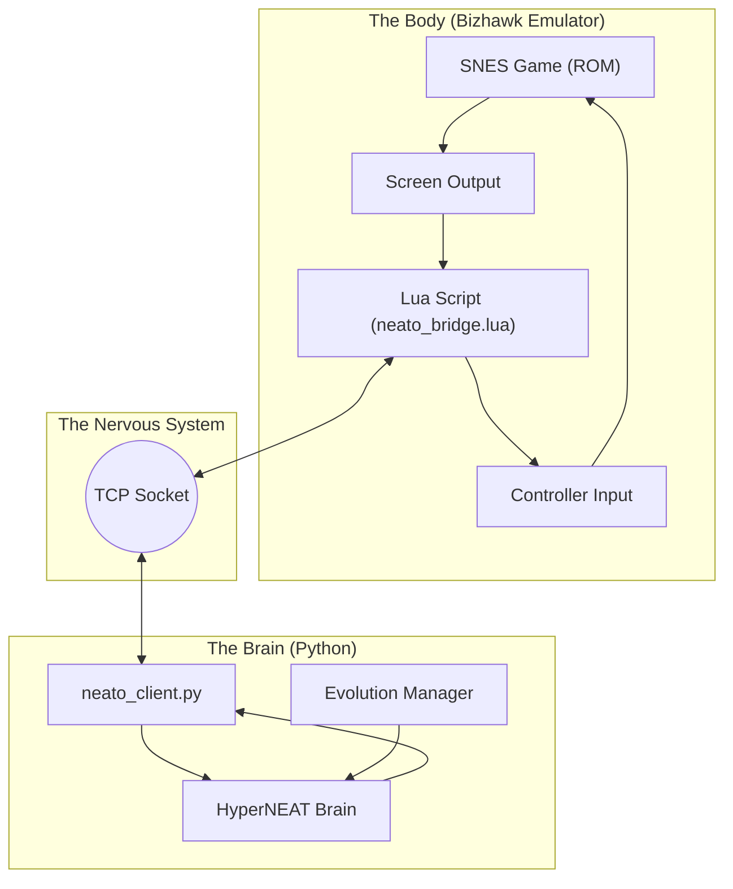
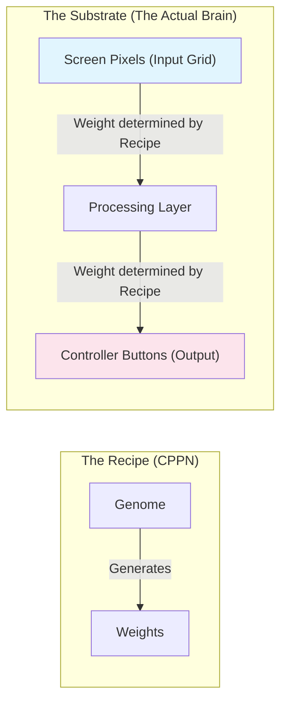

# Project Neato: Design Overview

## The Vision
Neato is an AI agent designed to learn how to play video games just by looking at the screen, similar to how a human does. Unlike traditional bots that are programmed with specific rules ("if enemy is close, jump"), Neato evolves its own brain through trial and error, eventually discovering complex strategies.

## System Architecture
The system consists of two main parts: the **Body** (Bizhawk Emulator) and the **Brain** (Python AI), connected by a digital nervous system (Socket Bridge).

## How Neato "Sees" (HyperNEAT)
SethBling's original MarI/O used a small grid of inputs. Neato needs to see the whole screen to play any game. However, a screen has thousands of pixels. Connecting every pixel to every decision is too complex for standard evolution.

**The Solution: HyperNEAT**
Instead of evolving the brain directly, we evolve a "recipe" (CPPN) that knows how to build a brain based on geometry.

1.  **Input**: The screen is treated as a geometric grid (X, Y coordinates).
2.  **Processing**: The CPPN function takes two points on the screen and asks, "Should these be connected?"
3.  **Result**: This allows Neato to understand concepts like "symmetry" or "local patterns" (e.g., a pipe looks the same whether it's on the left or right).

## The Evolution Cycle
Neato learns by "Survival of the Fittest".

1.  **Spawn**: Create 100 random Neato brains.
2.  **Evaluate**: Let each one play the game.
    *   *Challenge*: To ensure Neato isn't just memorizing Level 1, we drop it into random situations (Save States).
3.  **Select**: The ones that get the furthest or score the highest survive.
4.  **Mutate**: The survivors have "children" with slight random mutations (a new connection, a changed weight).
5.  **Repeat**: Over hundreds of generations, the brains become smarter.

## Generalization Strategy
To achieve the goal of a "General Game Player":

1.  **Visual Input**: We use raw pixels or a high-density tile grid, not hand-picked memory values. This works for any game.
2.  **Multi-State Training**: We train on a "curriculum" of save states.
    *   *Generation 1-10*: Easy jumps.
    *   *Generation 11-50*: Enemies and pits.
    *   *Generation 50+*: Complex platforming.
3.  **Novelty Search**: Instead of just rewarding "Distance Right" (which fails in mazes), we reward Neato for seeing *new* things or reaching *new* screen coordinates.
