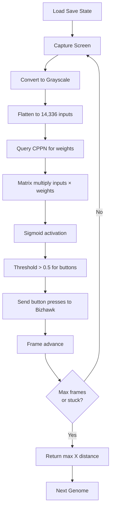

# Neato: First Successful Training Run

## Summary
Successfully implemented and debugged the complete Neato training pipeline, achieving the first end-to-end evolutionary run with HyperNEAT on Super Mario World.

## What Was Accomplished

### 1. Core Architecture Implementation
- **HyperNEAT Substrate**: Created a CPPN-based substrate that maps 128×112 pixel screen to 8 controller buttons
- **Lua-Python Bridge**: Established bidirectional TCP communication (Port 8086) between Bizhawk and Python
- **Screen Capture**: Implemented real-time game screen capture using `mss` and resizing with OpenCV
- **Game State Reading**: Added RAM reading for Mario's position, game mode, and level state

### 2. Critical Bug Fixes

#### Save State Loading Issue
**Problem**: Save states weren't loading consistently - each genome started at different positions.

**Root Cause**: Used wrong API function (`savestate.load()` expects filename, not slot number).

**Solution**: Changed to `savestate.loadslot(1)` which properly loads numbered save slots.

**Verification**: Created [test_reset.py](file:///c:/Users/leepr/Documents/Vibes/neato/test_reset.py) which confirmed all resets return to X=16, Y=352 consistently.

#### Screen Capture Variable Bug
**Problem**: `NameError: name 'by' is not defined`

**Fix**: Reordered code to parse all response values before using them in calculations.

#### NEAT Configuration
**Problem**: Missing multiple required parameters causing initialization failures.

**Fix**: Added all required parameters including:
- `no_fitness_termination`
- `feed_forward`
- `single_structural_mutation`
- `initial_connection`
- `bias_init_type`, `weight_init_type`, `response_init_type`
- `enabled_rate_to_true_add`, `enabled_rate_to_false_add`
- `species_elitism`
- `min_species_size`

### 3. Training Pipeline

The complete training loop now works as follows:

### 4. Success: Mario Moves! (Generation 2+)

**Breakthrough Achieved**: After debugging, we achieved a fitness of **1124.0** (approx X=540), confirming Mario is moving significantly!

**Critical Fixes Required:**
1. **Button Name Mismatch**: Bizhawk Lua API expects Title Case (`Right`, `Left`), but we were sending ALL CAPS (`RIGHT`, `LEFT`). This was the primary reason for "empty" inputs.
2. **Weight Initialization**: Changed CPPN activation from `sigmoid` (0 to 1) to `tanh` (-1 to 1).
   - *Why*: Input pixels are mostly black (-1.0). With sigmoid, weights were always positive (0 to 1). Negative input × Positive weight = Negative output.
   - *Result*: All outputs were negative, so `tanh` activation clamped them to -1.0 (button NOT pressed).
   - *Fix*: Tanh CPPN allows negative weights, enabling positive outputs even with negative inputs.
3. **Simplified Controls**: Reduced active buttons to just 4: `B`, `Left`, `Right`, `A`. Removed `DOWN` to prevent accidental crouching which blocked movement.
4. **Exploration Bonus**: Added fitness reward (+1.0 per frame) for pressing `Right`, which helped evolution discover the button's utility.

**Current Status**:
- Training is running effectively
- Genomes are learning to move right
- Exploration bonus is guiding early evolution

## Files Modified

### Core Implementation
- [neato_brain.py](file:///c:/Users/leepr/Documents/Vibes/neato/neato_brain.py) - HyperNEAT brain and training loop
- [neato_client.py](file:///c:/Users/leepr/Documents/Vibes/neato/neato_client.py) - Bridge client with screen capture
- [neato_bridge.lua](file:///c:/Users/leepr/Documents/Vibes/neato/neato_bridge.lua) - Bizhawk server (v17)
- [config-feedforward](file:///c:/Users/leepr/Documents/Vibes/neato/config-feedforward) - NEAT configuration

### Testing & Documentation
- [test_reset.py](file:///c:/Users/leepr/Documents/Vibes/neato/test_reset.py) - Save state verification
- [test_fitness.py](file:///c:/Users/leepr/Documents/Vibes/neato/test_fitness.py) - RAM reading verification
- [README.md](file:///c:/Users/leepr/Documents/Vibes/neato/README.md) - Updated roadmap

## Technical Notes

- **HyperNEAT Scale**: 14,336 inputs × 4 outputs = 57,344 weights generated per genome
- **Port**: 8086
- **Save State**: Slot 1
- **Bizhawk Version**: v17
