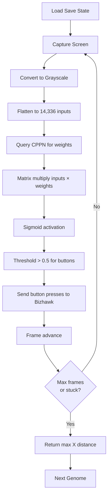

# Neato: First Successful Training Run

## Summary
Successfully implemented and debugged the complete Neato training pipeline, achieving the first end-to-end evolutionary run with HyperNEAT on Super Mario World.

## What Was Accomplished

### 1. Core Architecture Implementation
- **HyperNEAT Substrate**: Created a CPPN-based substrate that maps 128×112 pixel screen to 8 controller buttons
- **Lua-Python Bridge**: Established bidirectional TCP communication (Port 8086) between Bizhawk and Python
- **Screen Capture**: Implemented real-time game screen capture using `mss` and resizing with OpenCV
- **Game State Reading**: Added RAM reading for Mario's position, game mode, and level state

### 2. Critical Bug Fixes

#### Save State Loading Issue
**Problem**: Save states weren't loading consistently - each genome started at different positions.

**Root Cause**: Used wrong API function (`savestate.load()` expects filename, not slot number).

**Solution**: Changed to `savestate.loadslot(1)` which properly loads numbered save slots.

**Verification**: Created [test_reset.py](file:///c:/Users/leepr/Documents/Vibes/neato/test_reset.py) which confirmed all resets return to X=16, Y=352 consistently.

#### Screen Capture Variable Bug
**Problem**: `NameError: name 'by' is not defined`

**Fix**: Reordered code to parse all response values before using them in calculations.

#### NEAT Configuration
**Problem**: Missing multiple required parameters causing initialization failures.

**Fix**: Added all required parameters including:
- `no_fitness_termination`
- `feed_forward`
- `single_structural_mutation`
- `initial_connection`
- `bias_init_type`, `weight_init_type`, `response_init_type`
- `enabled_rate_to_true_add`, `enabled_rate_to_false_add`
- `species_elitism`
- `min_species_size`

### 3. Training Pipeline

The complete training loop now works as follows:

### 4. Current Training Status

**Generation 2+** is running with:
- **Population**: 20 genomes per generation
- **Starting Position**: X=16 (consistent across all genomes ✅)
- **Max Frames**: 600 frames (~10 seconds) per genome
- **Early Exit**: Stops if stuck for 60 frames

**Expected Behavior**: Early random networks (Generations 0-5) produce fitness of 16 (no movement) because they're not pressing useful button combinations yet. Evolution should eventually discover that pressing RIGHT increases fitness.

## Files Modified

### Core Implementation
- [neato_brain.py](file:///c:/Users/leepr/Documents/Vibes/neato/neato_brain.py) - HyperNEAT brain and training loop
- [neato_client.py](file:///c:/Users/leepr/Documents/Vibes/neato/neato_client.py) - Bridge client with screen capture
- [neato_bridge.lua](file:///c:/Users/leepr/Documents/Vibes/neato/neato_bridge.lua) - Bizhawk server (v17)
- [config-feedforward](file:///c:/Users/leepr/Documents/Vibes/neato/config-feedforward) - NEAT configuration

### Testing & Documentation
- [test_reset.py](file:///c:/Users/leepr/Documents/Vibes/neato/test_reset.py) - Save state verification
- [test_fitness.py](file:///c:/Users/leepr/Documents/Vibes/neato/test_fitness.py) - RAM reading verification
- [README.md](file:///c:/Users/leepr/Documents/Vibes/neato/README.md) - Updated roadmap

## Next Steps

1. **Monitor Evolution**: Let training run for 20-50 generations to see if any genomes discover movement
2. **Adjust Fitness**: Consider adding rewards for:
   - Pressing RIGHT button (immediate feedback)
   - Moving faster (velocity bonus)
   - Staying alive longer
3. **Optimize Performance**: The weight generation takes ~5s per genome (14k × 8 queries to CPPN). Could potentially:
   - Cache weights for identical genomes
   - Use fewer input pixels (downsample further)
   - Parallelize CPPN queries
4. **Visualization**: Create recording/screenshot system to capture best performers

## Technical Notes

- **HyperNEAT Scale**: 14,336 inputs × 8 outputs = 114,688 weights generated per genome
- **Port**: 8086 (previous ports 8080-8085 got locked)
- **Save State**: Slot 1 (1-indexed via `loadslot`)
- **Bizhawk Version**: v17 of bridge script
